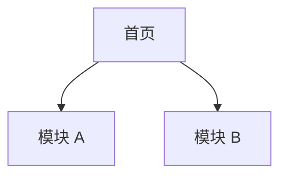
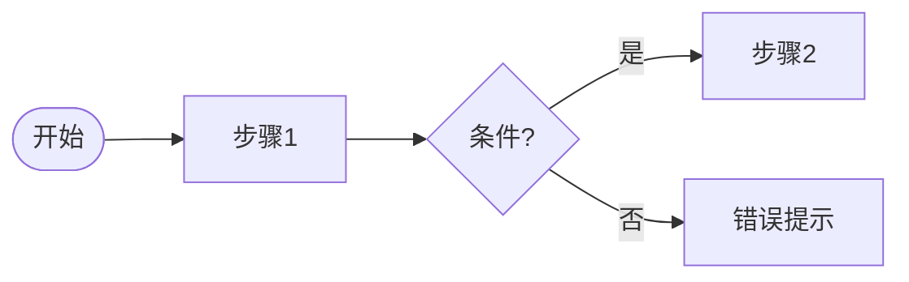

# [产品名称] 交互设计说明

> 版本：v0.1 | 关联 PRD：`02-prd.md` | 日期：YYYY-MM-DD

## 1. 设计目标与原则

（从 PRD/规划书提炼，3～5 条交互原则）

## 2. 信息架构



### 2.1 导航结构

| 层级 | 名称 | 说明 |
|------|------|------|

## 3. 核心用户流程

### 3.1 流程 F1：[名称]（对应场景 S1）



**涉及 FR：** FR-001, FR-002

## 4. 全局交互规范

| 类型 | 规则 |
|------|------|
| 加载 | 骨架屏 / Spinner，>300ms 显示 |
| 空态 | 文案 + 主操作 CTA |
| 错误 | 字段级 + 页面级；可重试策略 |
| 成功反馈 | Toast 2s / 跳转 |

## 5. 页面规格

### PG-001 [页面名称]

| 属性 | 内容 |
|------|------|
| 关联 FR | FR-001 |
| 入口 | 从 PG-xxx / 深链 |
| 出口 | 提交成功 → PG-xxx |

**布局（文字线框）：**

```text
+----------------------------------+
| 顶栏：返回 | 标题        | 操作 |
+----------------------------------+
| 主内容区                          |
|  [字段1 label] [input____]       |
|  [字段2 label] [select v]        |
|              [ 主按钮 ]          |
+----------------------------------+
```

**字段说明：**

| 字段 | 控件 | 校验 | 说明 |
|------|------|------|------|

**交互说明：**

1. 点击主按钮 → 校验 → 提交 → …

**状态：**

- 默认 / 加载 / 空 / 错误 / 无权限

---

（重复 PG-xxx）

## 6. 组件与模式（可选）

| 组件 | 用途 | 变体 |
|------|------|------|

## 7. FR ↔ 页面映射

| FR ID | 页面/流程 | 备注 |
|-------|-----------|------|

## 8. 待设计决策

> ⚠️ 待确认：
